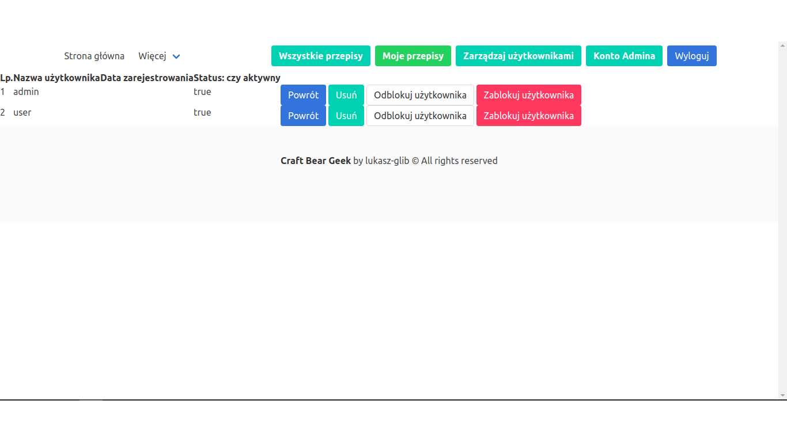

# Craft_Beer_Geek_WebApp
Web application Craft Beer Geek for enthusiasts of Craft Beer.

The Web App has been deployed to Heroku cloud and is available for viewing and testing under the following url:

https://craftbeergeek3.herokuapp.com/

Please check the app functionalities. There are two default users: user and admin. You can sign up your own account like user or check default user: 
- username: user
- password: user

Admin has also additional functionalities in cart "Zarządzaj użytkownikami" (User management).
Admin can block or unblock an account for all users and remove user's account as you can see below:

## Technologies

**Backend:** Java, Spring (Boot, Security, Form, Data JPA), Hibernate

**Frontend:** HTML, CSS, Bootstrap, Bulma

## Current Status

In progress.